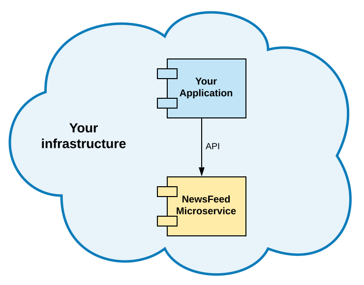
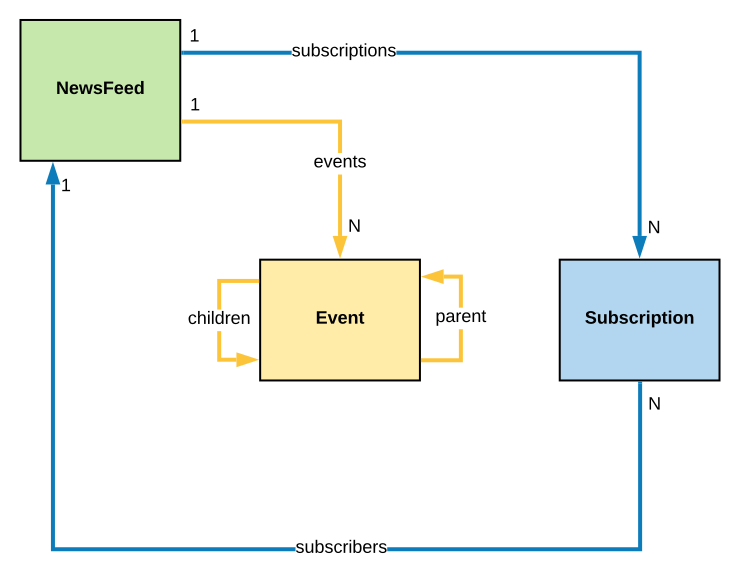

=====================
NewsFeed Microservice
=====================

*NewsFeed* - is a microservice that implements news feeds functionality. It is designed to be an
easy-to-integrate, self-hosted, and self-sufficient solution.

Implementing news feeds functionality is not a trivial task. It's implementation requires 
buffering, background processing and data denormalization approaches. Such implementations could 
cost money and take time, while *NewsFeed* is a ready-to-go microservice that could be deployed on
your infrastructure in minutes and then integrated to you application in a couple of hours.

The key features of the *NewsFeed* microservice are:

+ Simple, minimalistic, and easy-to-integrate API.
+ Self-sufficient.
+ Self-hosted.
+ Easy-to-deploy.
+ High performance.
+ Open sourced.
+ Documented.

Domain Model
------------

+ **NewsFeed** - is a main and central entity of the model. It does not own any particular data,
  but owns the ID. NewsFeed is the "virtual" root aggregate of the model. It's state is mainly
  defined by *events* and *subscriptions* relations.
+ **Subscription** - is an entity that represents fact of subscribing of one NewsFeed to another.
  When a *NewsFeed A* has a subscription to a *NewsFeed B*, then *NewsFeed A* is called
  **subscriber** of a *NewsFeed B*. All events that are published to *NewsFeed B* will be visible
  in *NewsFeed A* since *NewsFeed A* is a *subscriber* of *NewsFeed B*.
+ **Event** - is an entity that represents information that is published to a NewsFeed. When
  *Event A* is published to *NewsFeed A*, *Event A* data is published to all *NewsFeed A*
  *subscribers* as new *Events* that would be pointing to original *Event A* through its *parent*
  relation.
+ **Event Publishing History** - is a supportive entity that stores information about *Event*
  publishing. *Event Publishing History* is aware about all *NewsFeeds* where original *Event*
  is published during the event publishing process.
